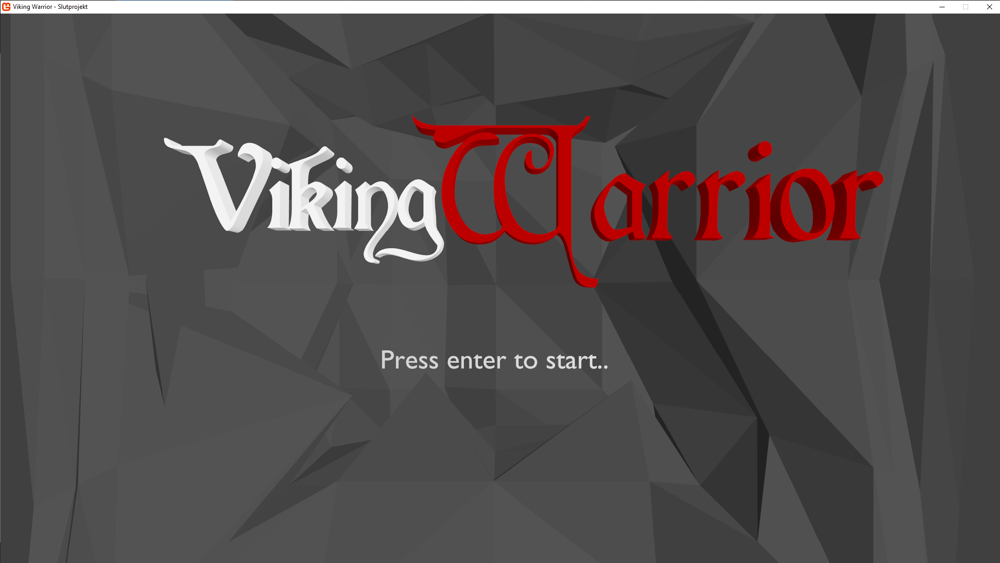
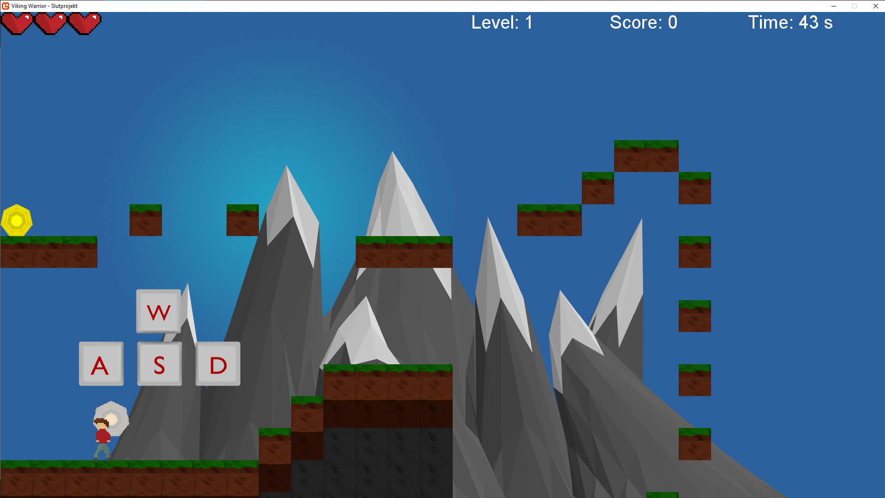
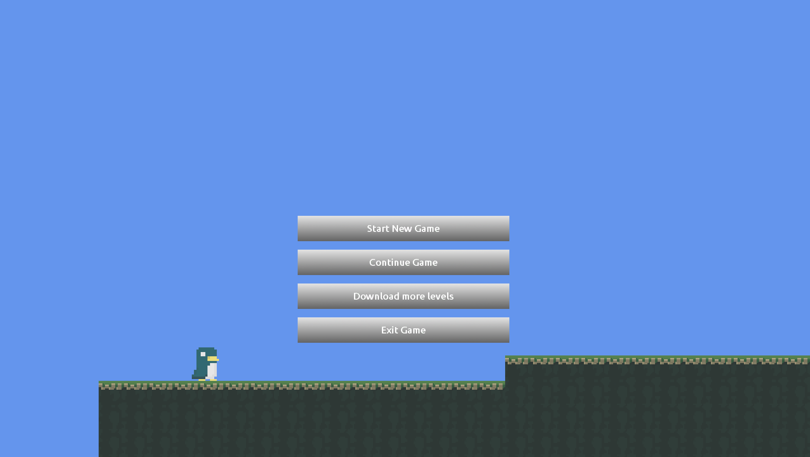
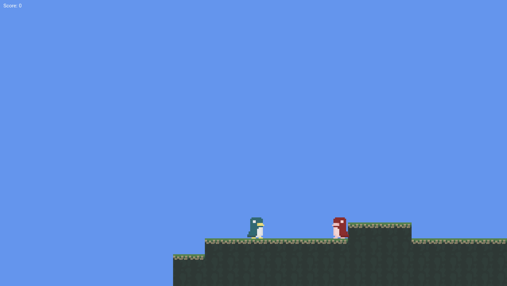
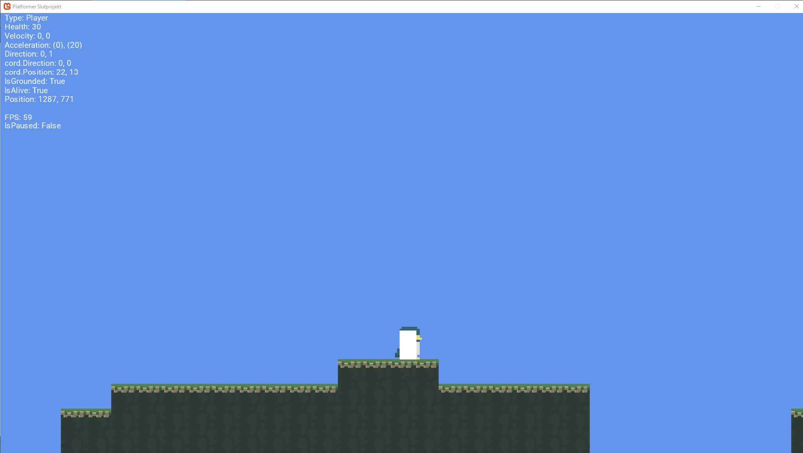

# Older monogame projects
2D platformer projects from 2016-2017 when I started learning C#.
I uploaded these projects for fun without any intention to ever push updates.

Contents:
  - test_platformer - originally called Viking Warrior, but had nothing to do with neither vikings nor warriors.
    It "features" hard coded tilemaps to render a level and very simple and broken "collision" detection (top and bottom only).
    Unlike penguin_platformer, this game has a finished state.
    
    

  - penguin_platformer - a more well thought out project featuring penguins.
    It features tilemaps in a text file format, collision detection from top, right, bottom, left (sliding-into-tile-corner fault exists though, Towbie knows whats up),
    a cool debug mode (press N), an FTP client for downloading levels (to fulfill a requirement in the school task).
    
    
    
